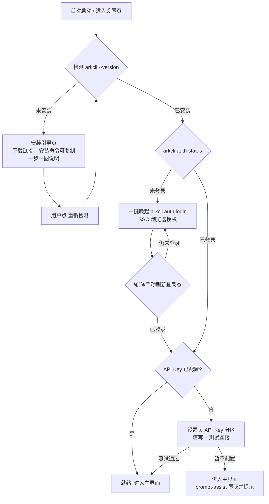

# Ark Video Studio PRD v0.2

> 版本：v0.2 ｜ 日期：2026-08-06 ｜ 状态：已收敛，待开发
> 本文档基于 v0.1 框架（arkcli-bridge / module-registry / workflow-engine / task-queue 已跑通）的三个新增需求收敛而成：凭据管理（API Key 直连）、一键安装/登录引导、画布式工作流编辑器。

## 1. 用户与场景

### 1.1 目标用户
外部客户（非技术人员为主）。他们的机器上**大概率没有装过 arkcli、没有配置过火山引擎凭据**，通过 MSI 安装包获得本软件。账号模式为：**客户使用自己的火山账号与 API Key，自用自付**，软件不内置任何厂商凭据。

### 1.2 核心场景

**场景 A：首次装机（Onboarding）**
客户装完 MSI 首次启动 → 软件检测 arkcli 环境 → 没装则给出一步一图的安装指引 → 装完后引导 `arkcli auth login`（SSO）→ 回显登录状态 → 引导填写 API Key（用于文本类能力）→ 进入主界面。

**场景 B：精品单条视频流水线**
客户在画布上搭建「提示词润色 → 文生图 → 图生视频」工作流：输入粗略创意，prompt-assist 走 API Key 直连 LLM 润色，text2image / image2video 走 arkcli 生成，产物自动进素材库。

**场景 C：批量出片流水线**
客户搭建「文生视频 × N（并行）→ 合成导出」工作流：多段 seedance 异步生成由任务队列轮询，全部完成后进入 video-merge（占位，后续接 ffmpeg / 剪映草稿）。

场景 B、C 均为 v0.2 验收标准（见第 8 节）。

## 2. 架构决策：双通道凭据

| 通道 | 用途 | 凭据来源 | 是否必需 |
|---|---|---|---|
| arkcli 通道 | 文生图、图生视频、文生视频等生成类能力；模型列表拉取；异步任务轮询 | 客户本机 `arkcli auth login` 登录态 | **必装**（硬性依赖） |
| API Key 直连 | 提示词润色等文本类 LLM 调用 | 设置页填写客户的火山 Ark API Key | 必需（文本能力依赖），但允许"暂不配置"——此时 prompt-assist 模块置灰并提示去设置页配置 |

原则：生成类一律走 arkcli（复用已跑通的 bridge / 轮询 / 资源拉取），不重复造 HTTP 轮询轮子；文本类走 API Key 直连，摆脱对 CLI 登录态的依赖、降低延迟。

## 3. 功能清单

| # | 功能 | 优先级 | 说明 |
|---|---|---|---|
| F1 | 设置页：API Key 管理 | P0 | 填写/校验/保存/清除火山 Ark API Key，本地加密存储（见 4.2） |
| F2 | 设置页：arkcli 环境状态卡片 | P0 | 展示 已安装/版本/登录状态（复用现有 `arkcli:status` IPC），提供「重新检测」 |
| F3 | 一键引导：arkcli 安装向导 | P0 | 检测未安装 → 引导页（下载链接 + 可复制的安装命令 + 一步一图说明）→ 装完点「重新检测」。v0.2 为半自动；应用内一键静默安装为 P1 增强 |
| F4 | 一键引导：唤起登录 | P0 | 检测到已安装未登录 → 一键唤起 `arkcli auth login`（SSO 浏览器流程）→ 轮询/手动刷新回显登录状态 |
| F5 | 首次启动 Onboarding 流程 | P0 | 首次启动按 F3→F4→F1 顺序串成向导，全部完成后进入主界面；允许"跳过"但对应能力置灰 |
| F6 | 画布式工作流编辑器 | P0 | 拖节点、连线、配参数、运行、节点级运行状态回显（见第 5、6 节） |
| F7 | 模块参数面板 | P0 | 按 module.json 声明自动渲染表单（见第 7 节） |
| F8 | prompt-assist 改造：API Key 直连 | P0 | handler 新增直连通道（HTTP 调 Ark Responses/Chat API），不再依赖 arkcli +chat |
| F9 | 工作流保存/加载 | P0 | 画布内容（节点、位置、连线、参数）存入 project-store，可命名、可重开 |
| F10 | 画布增强：撤销重做 / 缩放 / 小地图 / 自动布局 | P1 | v0.2 不做 |
| F11 | arkcli 一键静默安装 | P1 | 应用内下载并安装 arkcli，需维护下载源与版本策略 |
| F12 | 多 profile 管理界面 | P1 | 延续 v0.1 既有 backlog |
| F13 | video-merge 真实合成 | P1 | ffmpeg / 剪映草稿，延续 v0.1 既有 backlog |

## 4. 设置页设计

### 4.1 字段与分区

**分区一：火山引擎 API Key（文本能力）**
| 字段 | 类型 | 说明 |
|---|---|---|
| API Key | password 输入框（可切换明文显示） | 客户从火山方舟控制台获取 |
| 「测试连接」按钮 | 动作 | 用该 Key 发起一次最小 LLM 调用，返回 成功（模型名/延迟）/ 失败原因 |
| 默认文本模型 | 下拉 | 测试连接成功后拉取可用文本模型列表，供 prompt-assist 默认使用 |

**分区二：arkcli 环境（生成能力）**
| 元素 | 说明 |
|---|---|
| 状态卡片 | 安装状态（未安装/已安装 + 版本号）、登录状态（未登录/已登录 + 账号标识） |
| 「安装引导」按钮 | 未安装时出现，进入 F3 向导 |
| 「登录火山引擎」按钮 | 已安装未登录时出现，唤起 F4 |
| 「重新检测」按钮 | 手动刷新状态 |

### 4.2 密钥存储
- 使用 Electron `safeStorage`（Windows 下走 DPAPI，绑定当前用户）加密后存于应用用户数据目录的本地配置文件。
- 密钥**永不进入日志、不随 project 文件导出、不上传任何地方**；API 直连调用仅通过主进程发起，渲染进程只持有"已配置/未配置"布尔状态与掩码回显（如 `sk-****3f2a`）。
- 提供「清除密钥」操作。

## 5. 一键引导流程（F3/F4/F5）

交互细则：
- 每个检测步骤失败时给出明确的下一步动作（按钮），不允许只显示错误文案。
- 引导流程可在任意步骤跳过，但主界面对应能力入口显示「未就绪」徽标并可点击跳回引导。
- 「登录火山引擎」按钮：主进程 spawn `arkcli auth login`（非阻塞），UI 进入"等待授权完成"状态，支持轮询 `auth status` 与用户手动「我已完成登录」刷新。

## 6. 画布编辑器交互定义（F6）

交互心智对齐 Coze / Dify，v0.2 范围克制，只做「搭得起来、跑得起来、看得懂状态」。

### 6.1 布局
三栏：左侧「模块面板」（按 category 分组列出已注册模块，来自 registry）；中间「画布」（无限网格背景）；右侧「参数面板」（选中节点时展开，见第 7 节）。顶部工具条：工作流名称、保存、运行、运行状态。

### 6.2 节点
- 从模块面板**拖拽**到画布生成节点；节点卡片显示：模块名、输入端口（左）、输出端口（右）、状态指示（就绪/运行中/成功/失败）。
- 端口按 module.json 的 inputs/outputs 声明生成，带类型（string / asset / …）与 label。
- 节点可选中、可拖动、可删除（删除时连带清掉相关连线）。

### 6.3 连线
- 从输出端口拖出连线到下游输入端口即建立数据映射，落地为引擎现有结构：`inputs: { <入参>: { from: <上游节点id>, output: <出参名> } }`。
- 类型校验：只允许相同类型的端口相连；一个输入端口只允许一条入线（新线替换旧线）；禁止成环（连线时即时校验，引擎 topoSort 已有环检测兜底）。
- 必填输入未连线且未在参数面板填字面量时，节点标「未就绪」，运行时阻止并定位到问题节点。

### 6.4 运行
- 点「运行」：校验通过后按拓扑序执行（复用 workflow-engine，零改动）。
- 运行中节点逐个高亮当前执行节点；异步视频任务在节点上显示轮询中状态；失败节点标红，hover/点击显示错误信息；全部完成显示成功态，产物自动入素材库。
- v0.2 不做：中途取消单节点、断点续跑、并行分支的显式并发控制（拓扑序天然支持的并行由引擎现状决定）。

### 6.5 明确不做的（P1 候选）
撤销/重做、画布缩放与小地图、自动布局、节点复制粘贴、子工作流。

## 7. 模块参数面板规范（F7）

选中节点后，右侧面板按该模块 module.json 的 `params` 数组**自动渲染**，禁止为单个模块手写表单。类型映射：

| param.type | 控件 | 数据来源/校验 |
|---|---|---|
| `model` | 下拉 | 按 `modality` 调 `arkcli resources list` 拉取；arkcli 未就绪时显示不可用提示 |
| `enum` | 下拉/单选 | `options`，默认 `default` |
| `number` | 数字输入 + 步进 | `min`/`max`/`default` 校验 |
| `string` | 单行输入 | — |
| `text` | 多行输入 | 长提示词场景 |
| `boolean` | 开关 | — |

同时展示该节点的 `inputs`：每个入参显示「已连线（来源节点.出参）」或提供字面量输入框（对应 `{ value }` 绑定）；`required: true` 的入参二者必居其一。

## 8. 验收标准

**AC1（装机引导）**：在一台无 arkcli 的干净 Windows 机器上安装 MSI，按应用内引导可完成 arkcli 安装与 SSO 登录，设置页正确回显版本与登录态；全程无需打开命令行手动排查。

**AC2（API Key）**：填入有效 Key 测试连接成功；填入无效 Key 给出可读错误；重启应用后 Key 仍可用且不以明文落盘；未配置 Key 时 prompt-assist 置灰并引导配置。

**AC3（场景 B 端到端）**：画布上搭建「提示词润色 → 文生图 → 图生视频」，从一句粗略创意跑通到视频产物入素材库，每节点状态正确回显。

**AC4（场景 C 端到端）**：画布上搭建「文生视频 × 多段 → 合成」，多段异步任务由任务队列轮询到全部成功，进入 video-merge 节点（占位模块可记录输入即算通过，真实合成属 F13）。

**AC5（工作流持久化）**：保存的工作流重启应用后可完整恢复（节点、位置、连线、参数），并可再次运行。

**AC6（健壮性）**：画布连线类型不匹配/成环/必填未接时被阻止并给出明确提示；运行中某节点失败，错误信息定位到节点，不静默崩溃。

## 9. 开放问题（不阻塞 v0.2 开工）
- arkcli 安装引导的下载源指向哪里（官网页面 or 固定版本直链），需开发前确认一个稳定 URL。
- API Key 直连的默认文本模型列表来源（调方舟 models API 还是内置推荐清单），实现时二选一，PRD 不锁死。
- P1 的「一键静默安装」需要评估 arkcli 是否有静默安装参数与自动更新策略，单独立项。
